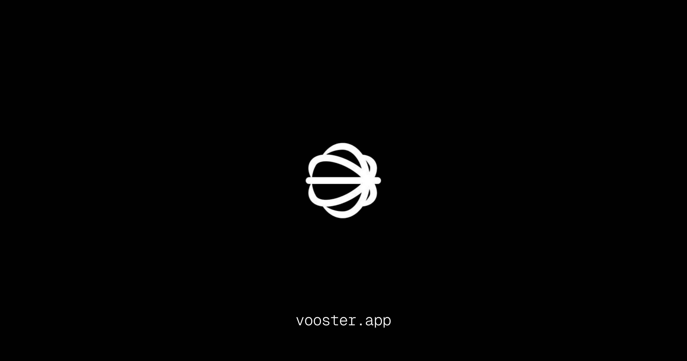

<p align="center">
	<h1 align="center"><b>vooster.app</b></h1>
<p align="center">
    Project started with <a href="https://github.com/midday-ai/v1">v1</a>.
    <br />
    <br />
    <a href="https://www.vooster.app"><strong>Website</strong></a> · 
    <a href="https://github.com/vooster-app/vooster/issues"><strong>Issues</strong></a> · 
    <a href="#whats-included"><strong>What's included</strong></a> ·
    <a href="#prerequisites"><strong>Prerequisites</strong></a> ·
    <a href="#getting-started"><strong>Getting Started</strong></a> ·
    <a href="#how-to-use"><strong>How to use</strong></a>
  </p>
</p>

Everything you need to build a production ready SaaS, it's a opinionated stack based on learnings from building Midday using the latest Next.js framework, it's a monorepo with a focus on code reuse and best practices that will grow with your business.

## What's included

[Next.js](https://nextjs.org/) - Framework<br>
[Turborepo](https://turbo.build) - Build system<br>
[Biome](https://biomejs.dev) - Linter, formatter<br>
[TailwindCSS](https://tailwindcss.com/) - Styling<br>
[Shadcn](https://ui.shadcn.com/) - UI components<br>
[TypeScript](https://www.typescriptlang.org/) - Type safety<br>
[Supabase](https://supabase.com/) - Authentication, database, storage<br>
[Upstash](https://upstash.com/) - Cache and rate limiting<br>
[React Email](https://react.email/) - Email templates<br>
[Resend](https://resend.com/) - Email delivery<br>
[i18n](https://next-international.vercel.app/) - Internationalization<br>
[Sentry](https://sentry.io/) - Error handling/monitoring<br>
[Dub](https://dub.sh/) - Sharable links<br>
[Trigger.dev](https://trigger.dev/) - Background jobs<br>
[OpenPanel](https://openpanel.dev/) - Analytics<br>
[Polar](https://polar.sh) - Billing (coming soon)<br>
[react-safe-action](https://next-safe-action.dev) - Validated Server Actions<br>
[nuqs](https://nuqs.47ng.com/) - Type-safe search params state manager<br>
[next-themes](https://next-themes-example.vercel.app/) - Theme manager<br>

## Directory Structure

```
.
├── apps                         # App workspace
│    ├── api                     # Supabase (API, Auth, Storage, Realtime, Edge Functions)
│    ├── app                     # App - your product
│    ├── web                     # Marketing site
│    └── ...
├── packages                     # Shared packages between apps
│    ├── analytics               # OpenPanel analytics
│    ├── email                   # React email library
│    ├── jobs                    # Trigger.dev background jobs
│    ├── kv                      # Upstash rate-limited key-value storage
│    ├── logger                  # Logger library
│    ├── supabase                # Supabase - Queries, Mutations, Clients
│    └── ui                      # Shared UI components (Shadcn)
├── tooling                      # are the shared configuration that are used by the apps and packages
│    └── typescript              # Shared TypeScript configuration
├── .cursorrules                 # Cursor rules specific to this project
├── biome.json                   # Biome configuration
├── turbo.json                   # Turbo configuration
├── LICENSE
└── README.md
```

## Package Documentation

Each package in the monorepo has its own documentation:

- [@vooster/supabase](./packages/supabase/README.md) - Type-safe database access and authentication
- [@vooster/ui](./packages/ui/README.md) - Shared UI components and styling

## App Documentation

Each app in the monorepo has its own documentation:

- [API](./apps/api/README.md) - Supabase API, Auth, Storage, Realtime, and Edge Functions

## Prerequisites

Bun<br>
Docker<br>
Upstash<br>
Dub<br>
Trigger.dev<br>
Resend<br>
Supabase<br>
Sentry<br>
OpenPanel<br>

## Getting Started

1. Install dependencies using bun:

```sh
bun i
```

2. Copy `.env.example` to `.env` and update the variables.

```sh
# Copy .env.example to .env for each app
cp apps/api/.env.example apps/api/.env
cp apps/app/.env.example apps/app/.env
cp apps/web/.env.example apps/web/.env
```

4. Start the development server from either bun or turbo:

```ts
bun dev // starts everything in development mode (web, app, api, email)
bun dev:web // starts the web app in development mode
bun dev:app // starts the app in development mode
bun dev:api // starts the api in development mode
bun dev:email // starts the email app in development mode

// Database
bun migrate // run migrations
bun seed // run seed
```
